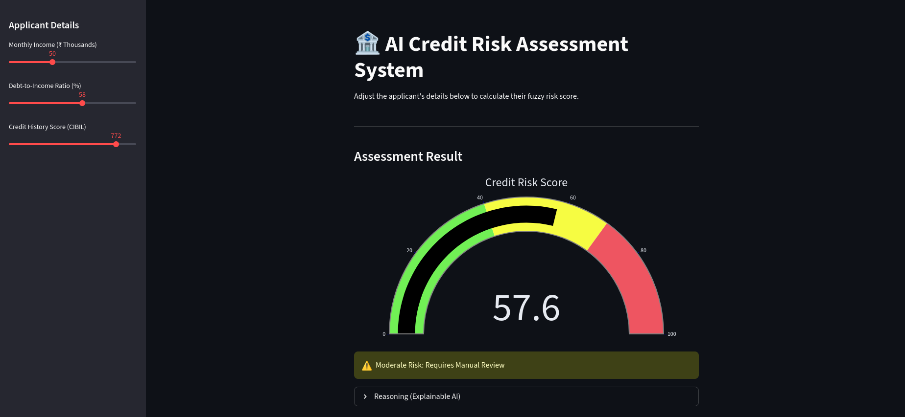
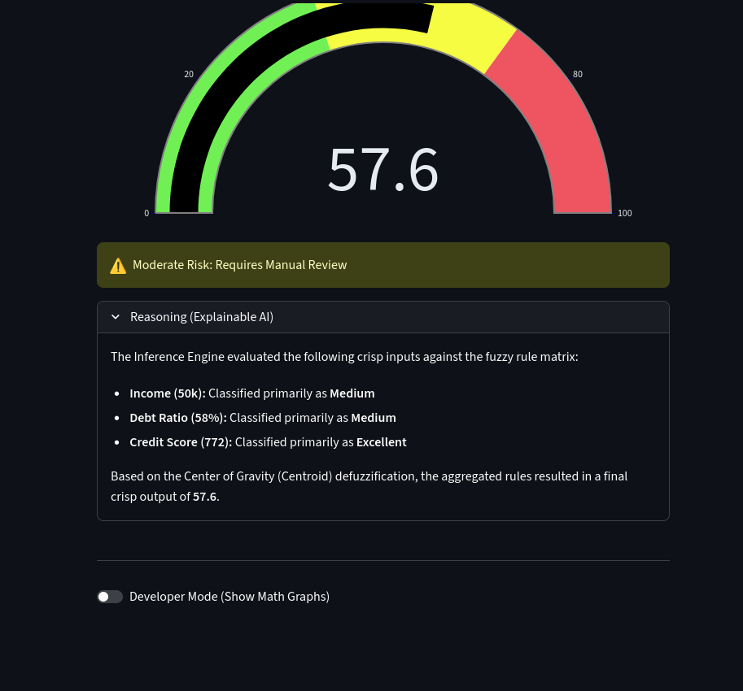
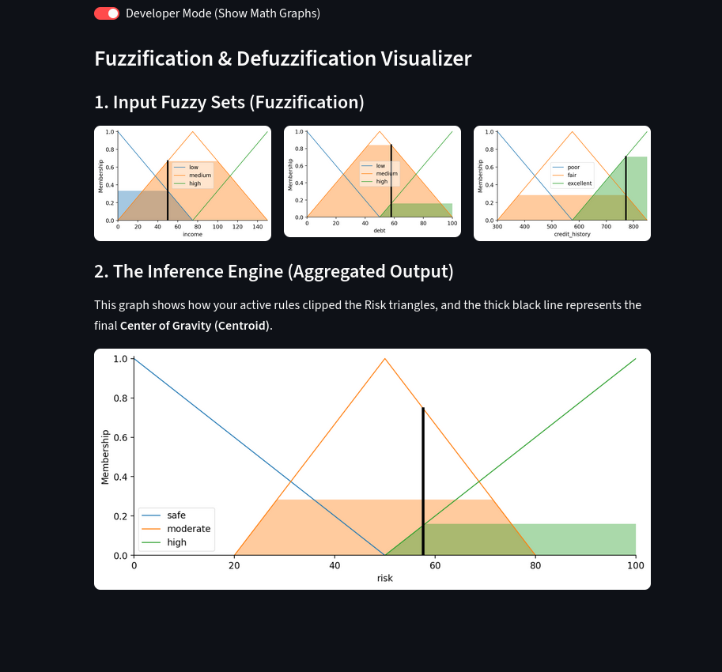
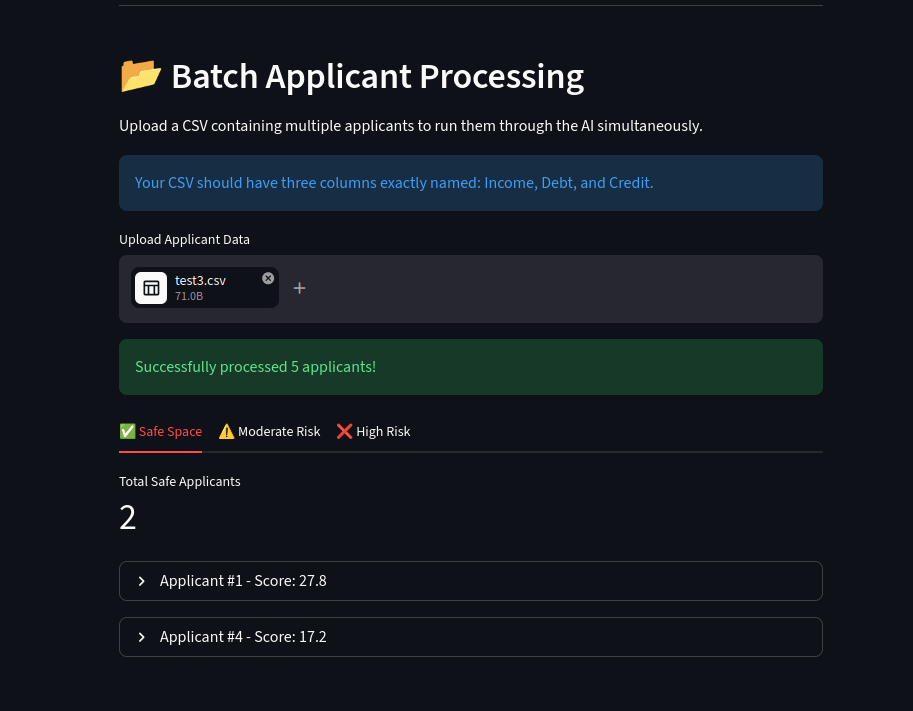
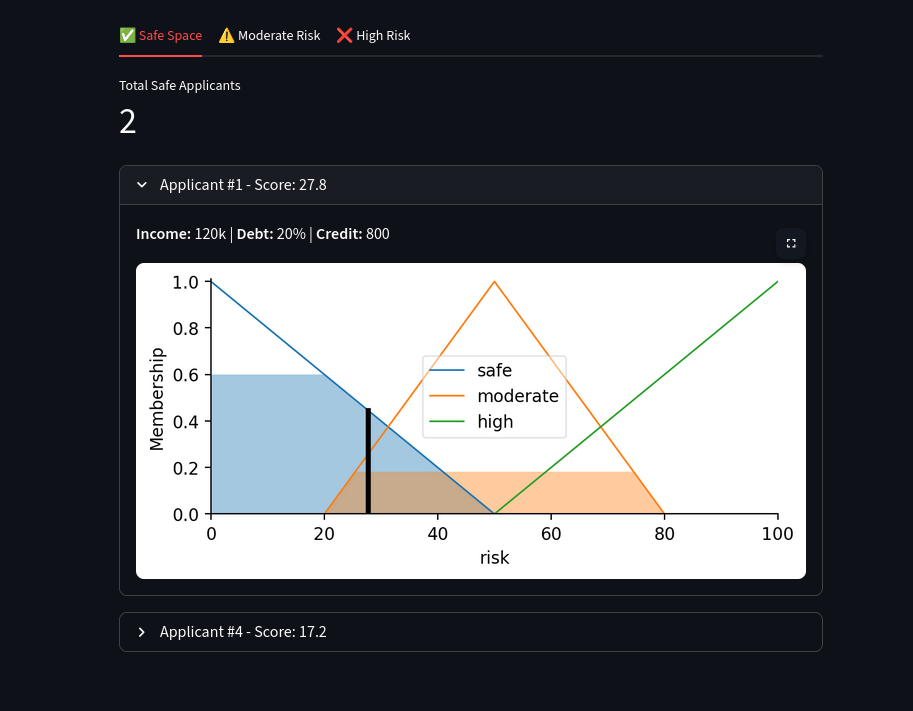

# 🏦 AI Credit Risk Assessment System

## Overview
This project is a Fuzzy Inference Expert System designed to dynamically evaluate loan applicant risk. Unlike traditional Boolean logic systems that rely on hard, rigid cutoffs, this engine uses mathematical fuzzy sets to evaluate non-linear financial and behavioral parameters (Income, Debt, and Credit History), closely mimicking human expert decision-making. 

The system features a real-time interactive dashboard, Explainable AI (XAI) to translate mathematical outputs into human-readable reasoning, and a built-in "Developer Mode" visualizer to map the fuzzification and defuzzification processes. 

It also includes an **Enterprise Batch Processing** module, allowing managers to upload large CSV datasets and instantly sort applicants into categorized risk tabs with drill-down mathematical reports.

## 🛠️ Tech Stack & Libraries
* **Python**: Core backend language.
* **scikit-fuzzy**: The mathematical engine handling the Fuzzy Inference System (Mamdani approach & Centroid defuzzification).
* **Streamlit**: For building the reactive web UI and real-time frontend dashboard.
* **Pandas**: For robust CSV data ingestion, buffer management, and batch processing.
* **Plotly**: For the animated, dynamic risk-gauge visualizations.
* **Matplotlib**: For rendering the overlapping fuzzy membership triangles and active rule clipping on the fly.
* **Docker & Docker Compose**: The entire environment is containerized for seamless, cross-platform deployment without local dependency conflicts.

## 📸 Application Features & Screenshots







### The Executive Dashboard

*Real-time risk evaluation using dynamic Plotly gauge charts for single-applicant assessment.*

### Enterprise Batch Processing & Drill-Down


*Scalable "Overview-to-Drill-Down" UI. Ingests CSV data, bypasses encoding errors, and categorizes applicants into Safe, Moderate, and High-Risk tabs. Managers can expand individual applicants to view isolated, dynamically generated defuzzification graphs.*

### Explainable AI (XAI) Logic

*Transparent breakdown of how the inference engine translated crisp inputs into fuzzy sets and calculated the final centroid.*

### Mathematical Visualizer (Developer Mode)

*Real-time rendering of active rule clipping, overlapping input matrices, and center of gravity calculations.*

## 🚀 How to Run Locally

Because this application is fully containerized, you do not need to manually install Python or manage virtual environments on your local machine. You only need Docker installed.

1. **Clone the repository:**
   ```bash
   git clone [https://github.com/banana-boii/credit-risk-assessment.git](https://github.com/banana-boii/credit-risk-assessment.git)
   cd credit-risk-assessment

2. **Build and spin up the container:**
   ```bash
   sudo docker compose up --build

   (Note: If you run into any cache issues during the build, run sudo docker compose build --no-cache to force a clean installation).

3. **Access the application:**
   ```Plaintext
   http://localhost:8501

4. **Testing the Batch Processor:**
   ```Plaintext
   To test the CSV upload feature, ensure your file is a pure UTF-8 or Latin-1 encoded .csv file. The first row must contain exactly these headers (case-sensitive):
   Income,Debt,Credit

4. **To stop the application:**
   ```Plaintext
   Simply press Ctrl+C in your terminal to safely spin down the container.